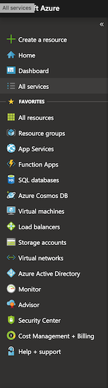
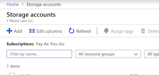
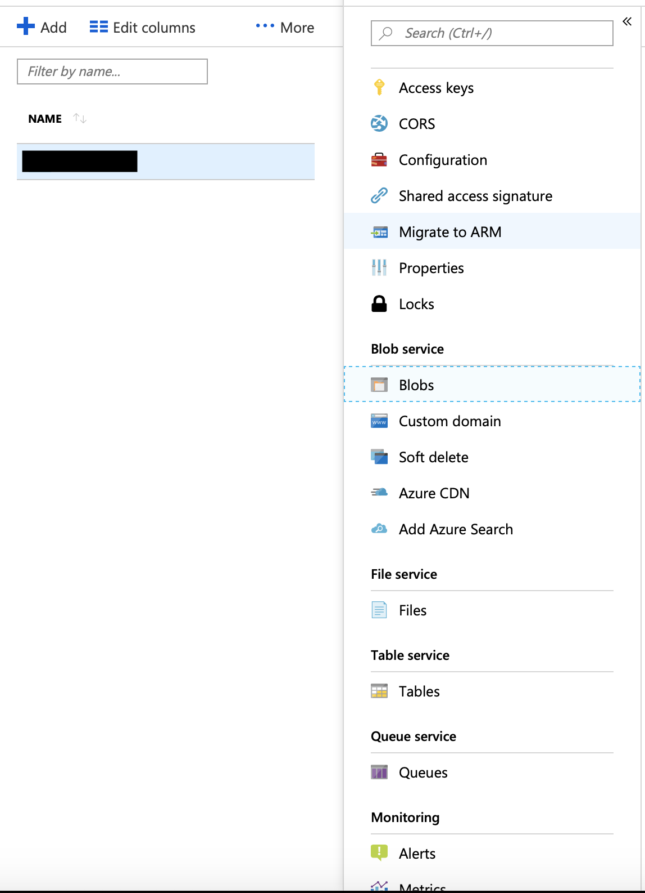
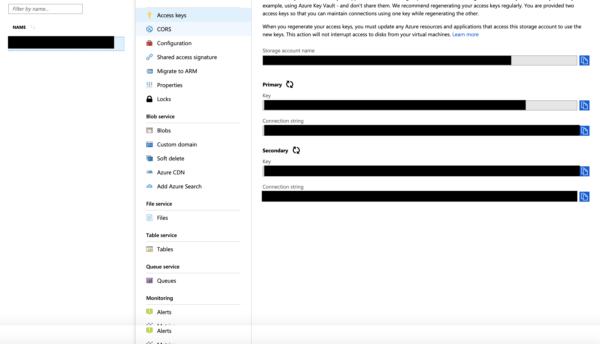

##Microsoft Azure Mobile Android Upload Blob Sample
##Introduction

Azure Storage is a Microsoft-managed service providing cloud storage that is highly available, secure, durable, scalable, and redundant. Azure Storage includes Azure Blobs (objects), Azure Data Lake Storage Gen2, Azure Files, Azure Queues, and Azure Tables. 
	This application demonstrates an image upload to blob storage.

##Summary
This app uploads frames as seen by the device's camera to Microsoft Azure Storage. The app operates in capture mode and frame by frame capture mode. In capture mode it uploads a single photo taken from the device. In frame by frame capture mode it uploads frames seen by the camera every 1 seconds for next 20 seconds.


##Prerequisite

1. Android Studio
2. A device with camera
3. An Azure Account 

###Server setup
1. Login to [Azure Portal](https://portal.azure.com/#home).  
2. Select **Storage Account**

   

3. Click + to add storage account. 

. 

4. You have to add the blob container to organize the files. You can do that by clicking on ```Home->Storage Accounts->'Storage Account Name'->Blob service->Blobs```



Now your Azure portal is ready to store images.

##Before Running Application

 Please assign following values in application  
  1. Assign the values of your bucket name ```public static final String BUCKET_NAME = "***" ``` in Constant.java  
  2.  Chnage the value of ``` private static final String STORAGE_CONNECTION_STRING ="***"``` with appropriate value in StorageProvider.java

  You can get connection string from here 
     
  


