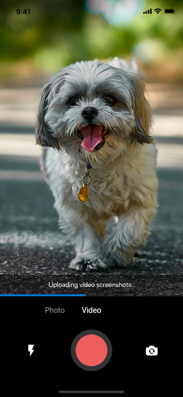
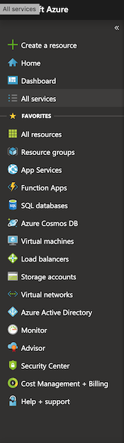
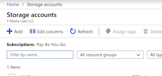
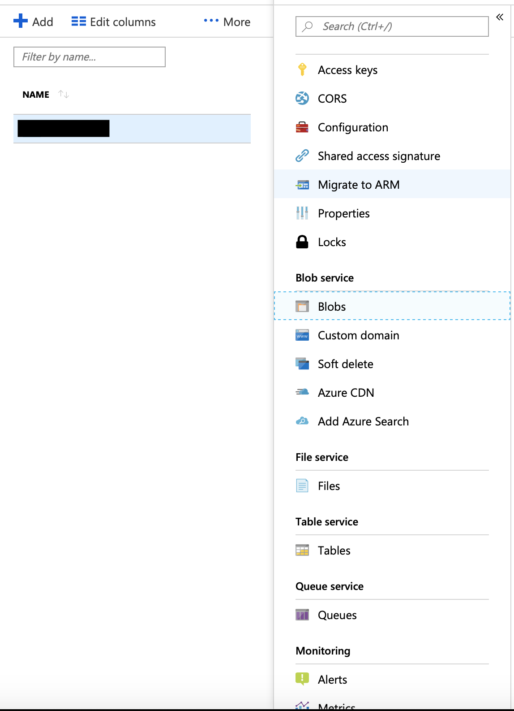
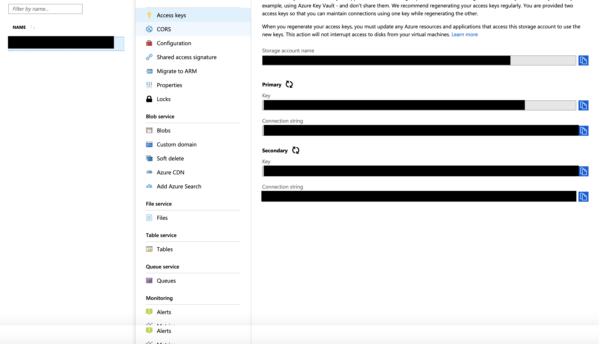

##Microsoft Azure Mobile Upload Blob Sample for iOS


##Summary
This app uploads frames as seen by the device's camera to Microsoft Azure Storage. The app operates in capture mode and frame by frame capture mode. In capture mode it uploads a single photo taken from the device. In frame by frame capture mode it uploads frames seen by the camera every 0.5 seconds.



##Requirements

* Please make sure that you have the minimum specified Xcode version installed on your Mac before executing the project   
 
* You require an iOS device with a working camera. 

* You should have a valid Apple Developer ID.
*  You will also require a Microsoft Azure Account. If you don't have one please visit this [link](https://azure.microsoft.com/en-in/free/search/?&OCID=AID719810_SEM_zzMihbWf&lnkd=Google_Azure_Brand&dclid=CM2Fx4Txl-ACFRdGKwodpFUFOQ 
) to create a new account.


##Server setup

1. Login to [Azure Portal](https://portal.azure.com/#home).  
2. Select **Storage Account**  
   
3. Click + to add storage account.  
. 
4. You have to add the blob container to organize the files. You can do that by clicking on ```Home->Storage Accounts->'Storage Account Name'->Blob service->Blobs```  


Now your Azure portal is ready to store images.

##Building the Application

1. You should install CocoaPods on your system if you already don't have it.
```sudo gem install cocoapods```  

2. You have to install the pods that are specified in the pod file from terminal. Navigate to the directory containing the pod file.  
```cd Azure.Mobile/Example/AzureStorage/iOS/AzureStorageSample/```  
``pod install```  

3. After your pod has been installed, you will see a new file, namely ```AzureStorageSample.xcworkspace```. Open ```AzureStorageSample.xcworkspace``` to view and build the project.

4. You will have to grant permissions to use the device's camera.

5. In this application we are using Azure Shared Key Access Method to authenticate our uploads.  
Please visit the following link to get a detailed documentation on using [Azure Blob storage in iOS](https://docs.microsoft.com/en-us/azure/storage/blobs/storage-ios-how-to-use-blob-storage).

6. Please assign the following variables in **AzureEngine.swift** with your account credentials.

```
private struct Constants {
    static let accountKey: String? = nil
    static let accountName: String? = nil
    static let blobContainerName: String? = nil
  }
```
**accountName** is the name of the storage account you added during server setup.  
You can get the **accountKey** by going visiting: 
```Home->StorageAccounts->'Account Name'->Access keys```
 
**blobContainerName** is the name of the blob to which you want to upload your files.
  
 
##Architecture
This app is written in Swift. The Microsoft Azure Storage Library is written in Objective C. The library calls are bridged from Objective C to swift. You can take a look at the documentation for bridging in iOS.

##References

* [Create Azure Account](https://azure.microsoft.com/en-in/free/search/?&OCID=AID719810_SEM_zzMihbWf&lnkd=Google_Azure_Brand&dclid=CM2Fx4Txl-ACFRdGKwodpFUFOQ 
)  
You can visit this link to create an Azure account

* [Azure Blob storage in iOS](https://docs.microsoft.com/en-us/azure/storage/blobs/storage-ios-how-to-use-blob-storage).  
This documentation explains how to use Azure Blob Storage in iOS.

* [Apple Developer Guide on Importing Objective C into Swift](https://developer.apple.com/documentation/swift/imported_c_and_objective-c_apis/importing_objective-c_into_swift)  
This documentation provides information on how to use bridging in iOS.


